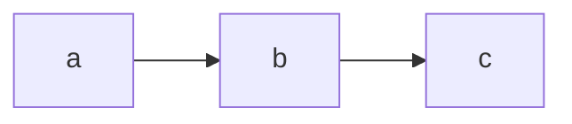

# metadoc-md

This [metadoc](https://github.com/author/metadoc) post-processor will convert any markdown, mermaid, or MathJax code within description attributes of a metadoc into  HTML.

_Metadoc output before metadoc-md:_


_Metadoc output after metadoc-md:_


## Usage

This processor can be run standalone or as a part of a metadoc build process.

To run as a standalone CLI application, the utility must be installed globally:

`npm install -g @author.io/metadoc-md`

It can then be run as:

```sh
metadoc-md --source /path/to/metadoc/api.json
```

Alternatively, it can be run as part of a series of metadoc processors. In this scenario, the module should be saved as part o the `devDependencies`:

`npm install @author.io/metadoc-md --save-dev`

It can then be used as a part of the metadoc generation process:

```sh
metadoc --source ./src --output ./docs --warnskippedevents --warnnocode --ignore ./work/in/progress | metadoc-md
```

## Additional Flags

Each flag (except `--output`) can receive a `true`/`false` to enable/disable a feature. For example, to explicitly disable GFM, use `--gfm false`.

- `--output` Specify a custom output file name.
- `--pedantic` Conform to the original markdown.pl as much as possible. Don't fix original markdown bugs or behavior. Turns off and overrides gfm.
- `--gfm` Apply [Github Flavored Markdown](https://github.github.com/gfm/). Enabled by default
- `--tables` When using `gfm`, use [GFM Tables extension](https://github.github.com/gfm/#tables-extension-). Enabled by default.
- `--breaks` 	If true, use GFM hard and soft line breaks. Requires `gfm` be true.
- `--smartlists` If true, use smarter list behavior than those found in markdown.pl.
- `--smartypants` If true, use "smart" typographic punctuation for things like quotes and dashes.
- `--xhtml` If true, emit self-closing HTML tags for void elements (<br/>, , etc.) with a "/" as required by XHTML.
- `--svg` Renders mermaid SVG files. See mermaid support secction below.

These features are all implemented by passing configuration values into [marked configuration options](https://marked.js.org/#/USING_ADVANCED.md#options).

## Mermaid Support


[Mermaid](https://github.com/knsv/mermaid) generates graphical SVG diagrams from text. It follows a markdown-like approach. metadoc-md identifies mermaid text and converts it to an HTML-friendly format.

For example:

_Metadoc output before metadoc-md:_

````

````

_Metadoc output after metadoc-md:_

```html
<div id="mermaid1" class="mermaid">
  graph LR
  a-->b;
  b-->c;
</div>
```

As shown above, metadoc-md identifies mermaid code and generates an HTML container for it with an automatic ID. However; it does not generate the SVG graphic. Mermaid provides a browser [browser library](https://www.jsdelivr.com/package/npm/mermaid) for this, which can parse the HTML and replace it with an SVG graphic. See the [usage instructions](https://mermaidjs.github.io/mermaidAPI.html)) for detail.

### Recognized Mermaid Types

- sequenceDiagram
- classDiagram
- graph (flowcharts)
- gitGraph
- gantt

## MathJAX Support


[MathJax](http://mathjax.org/) will generate equation displays from text. Metadoc-md identifies these equations using a markdown-like approach.

For example:

_Before metadoc-md:_

````
```math-tex
x = {-b \pm \sqrt{b^2-4ac} \over 2a}
```
````

_After metadoc-md:_

```html
<div id="math1" class="math">
  x = {-b \pm \sqrt{b^2-4ac} \over 2a}
</div>
```

As shown above, metadoc-md identifies MathJax code and generates the HTML container for it. Notice the language is `math-tex`, indicating the equation content is LaTeX format. `math-inlinetex`, `math-asciimath`, and `math-mathml` are also supported by MathJax. However; metadoc-md does not generate any graphics. The [MathJax Getting Started Guide](https://www.mathjax.org/#gettingstarted) provides instructions for generating the graphics in the browser.
